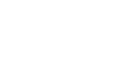
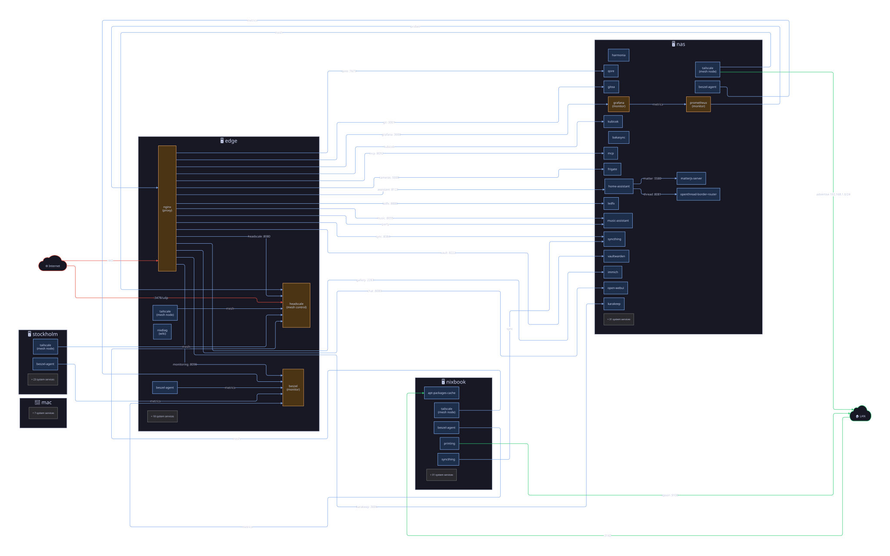
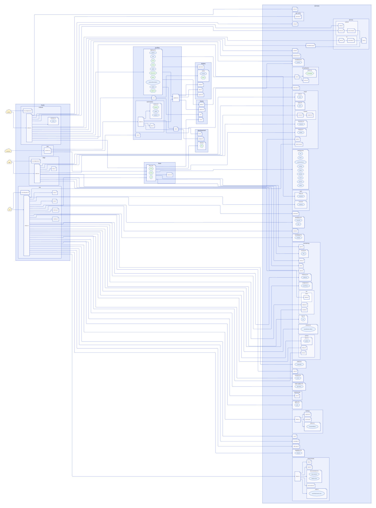
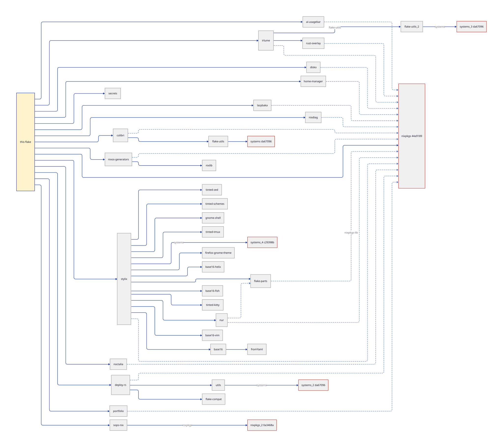
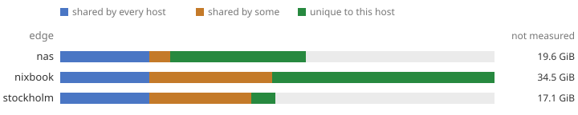

<samp>This system is my best attempt at recreating a personal, "Apple like"
ecosystem through a powerful yet simple principle: declare everything that can
be declared. It is only possible because enough people grew tired of endless
repetitive configuration, and of the fatal mistakes waiting along that path. So
we have Nix, in my opinion the best open source language in its class for
declaring your vision.</samp>

### Status

### Topology

### Module tree

### Flake inputs

### Closure sizes

