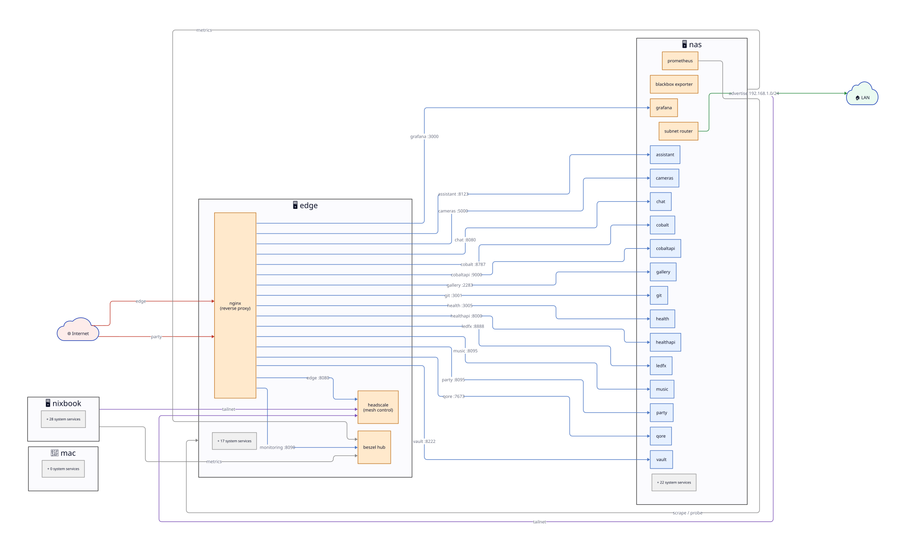
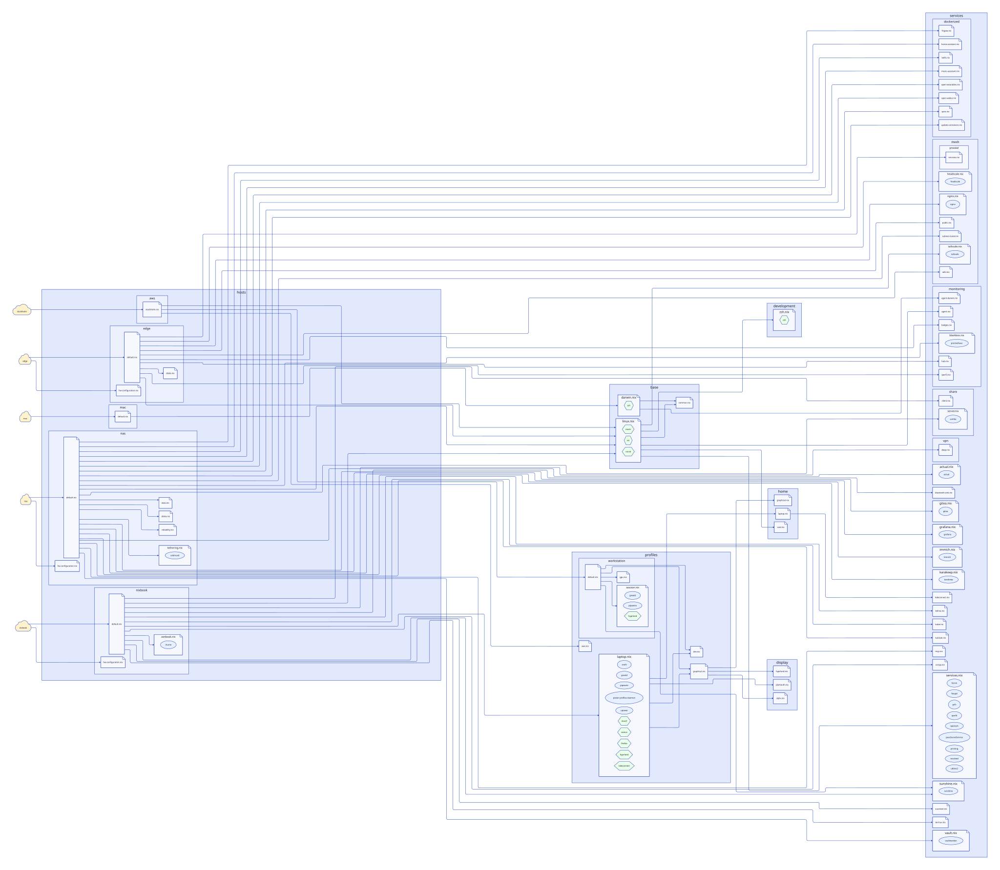

<!-- Auto-generated from the Nix config by gen-wiki.py. Do not edit. -->

# Architecture

## Data-flow topology

What talks to what across the fleet.

## Module tree

How each host is assembled from the module files in this repo.

